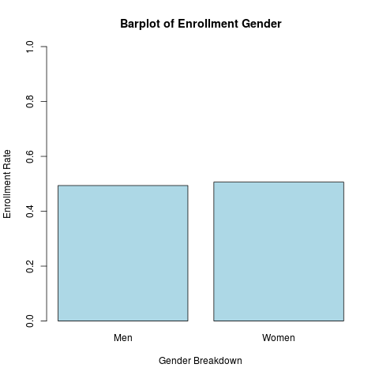
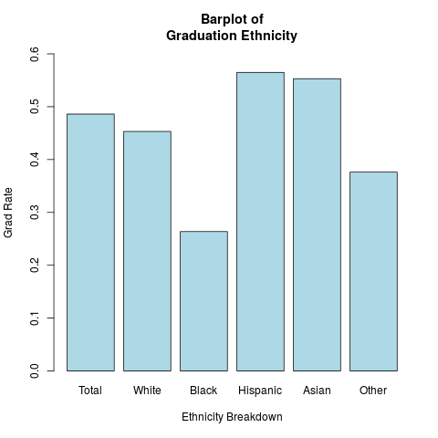

```{r setup, include=FALSE}
knitr::opts_chunk$set(echo = FALSE)
```

# Background  

## Introduction  
Goals: 

1. Determine succesful 4-year art schools in California in terms of diversity and graduation rate

2. Develop a Shiny Web App to observe the Difference between Two art schools

## Original Data
Source: College Scorecard

Data from Most-Recent-Cohorts-All-Data-Elements.csv and consists of many variables

# Process

## Cleaned Data

Actually this data set contained way to many variables

1. Filtered for California 4-year art schools

2. Interested in Columns associated with:
	- Enrollment
	- Ethnicity
	- Age
	- Graduation Rate
	- Gender
	- Average Family Income 

## Method - Models  
The following models were considered to help our client: 
- Ordinary Least Squares Regression
- Ridge Regression 
- Lasso Regression
- Principal Components Regression
- Partial Least Squares Regression  


# Analysis  

## Summary 

### EDA Analysis
   **Average Age of Enrolled Student**
   
   <br>
   
   **Gender of Enrolled Student**
   
   <br>
   
   **Ethinicity Distribution of Graduation Rate**
   
   <br>
   
### Model 
```{r, results = "asis", echo = FALSE, message = FALSE, warning = FALSE, fig.align = "center"}
load('../data/OLS.Rdata')
load('../data/PCR.Rdata')
load('../data/Lasso.Rdata')
load('../data/Ridge.Rdata')
load('../data/PLSR.Rdata')
library(xtable)


```

## App  
1. Choose 2 schools to compare
2. Choose what variable to compare:
	- Gender 
	- Ethnicity 
	- Graduation Rate
3. Decide the chart type 
4. Output: 2 charts(of the specified type) for each school using the choosen variable


# Conclusion
  EDA Analysis: common enrolled age: 22 or 28; even split between female and male students;  Hispanic and Asian have
  the highest graduation rate while Black student has the lowest
  
  Regression Model: Positive and Negative linera relationship both present between selected variables vs graduation rate

# Thank you and Questions? 
